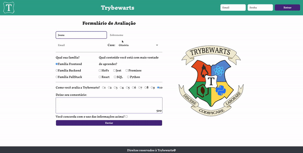

# Trybewarts Wizarding School 🧙

<strong>Bem-vindo ao projeto Trybewarts Wizarding School!</strong>

Este projeto é uma página de formulário da Escola de Magia de Trybewarts, onde os estudantes podem enviar seus feedbacks. Inspirado na obra "Harry Potter" de J.K. Rowling, o projeto traz um toque mágico para o mundo da programação.

# Visão Geral

A página possui um formulário simples onde os estudantes podem inserir seu nome, sobrenome, e-mail, casa de Trybewarts (Gryffindor, Hufflepuff, Ravenclaw ou Slytherin), e também uma avaliação da escola.

Além disso, a página apresenta uma estilização envolvente inspirada no ambiente mágico da escola.

# Demonstração

💡 Veja a seguir uma demonstração do projeto.



# Configuração

Para visualizar o projeto localmente em seu computador, siga estas etapas:

1. Clone este repositório para sua máquina local usando o seguinte comando:

```bash
git clone git@github.com:thainaabrantes/trybewarts.git
```

2. Navegue até o diretório do projeto:

```bash
cd trybewarts
```

3. Abra o arquivo index.html em seu navegador preferido para visualizar a página.

# 🧑‍💻 Tecnologias Utilizadas

- `HTML`
- `CSS`
- `JavaScript`

# 🚀 Contribuição

Contribuições são bem-vindas! Para sugestões, correções de bugs ou melhorias, por favor, abra uma issue ou submeta um pull request.

# Licença

Este projeto está licenciado sob a Licença MIT.
